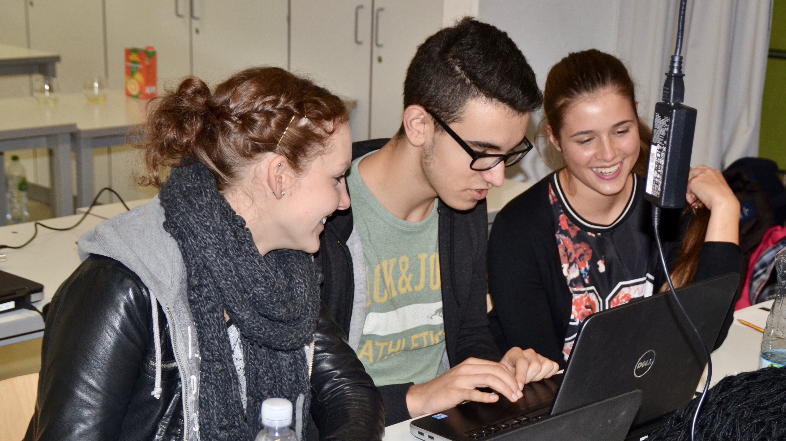
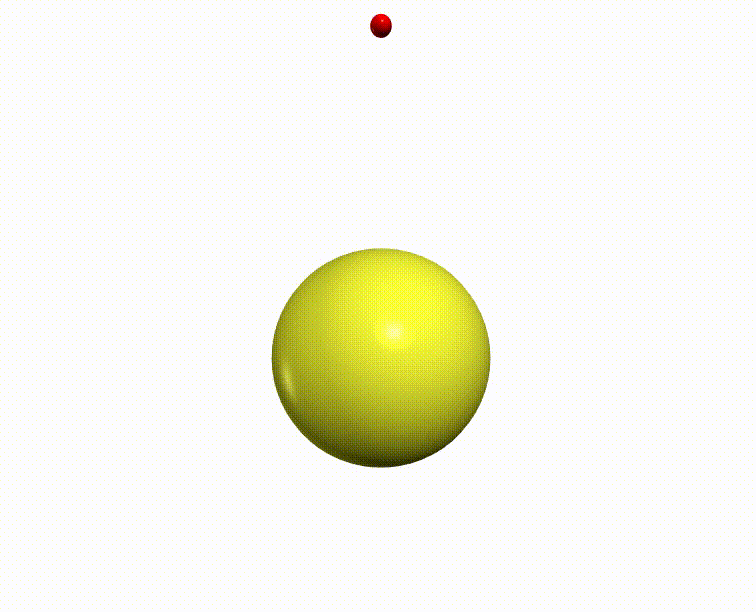
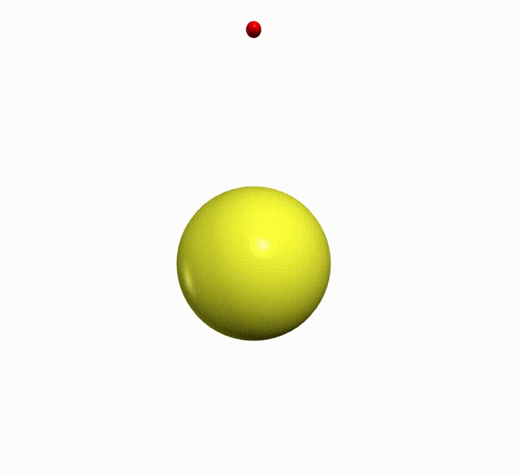

# Physics Simulations for High-School Students

## Students program their first physics simulations demonstrating effects of General Relativity -- in just one day

When I was in high-school, my biggest interest were phenomena beyond the scope of what I currently knew.
Unfortunately then I did not yet have the theoretical toolbox to dig deep.
But even though I was not able to compute things myself, I could grasp some insights of nature through visualizations.
Since then, numerical simulations have become part of my every day work.
Today they are often the best method to solve complicated problems such as describing nature through its fundamental building blocks in my job as a physicist.
Sadly, physics education was rarely combined with programming in school in my time and little has changed since.

In 2014 one of the authors of our publication, J. Heuer, did a school project for which she simulated the motion of planets in the solar system already allowing for post-Newtonian effects.
The next year, we adapted her project to create a course for the ["Schülerakademie Teilchenphysik"](https://crc110.hiskp.uni-bonn.de/index.php?id=327) ("Student Academy for Particle Physics") held at the Science Center Overbach in Jülich, Germany.
The week long academy takes place every two years and aims at high-school students from grade 10 to 13 (age 16 to 19) from all over Germany.
It offers several activities such as
* lectures on various topics in particle physics,
* a tour of the particle accelerator COSY and
* a visit to the high-performance computing facility at the Research Center Jülich.

At the end of the course, the last day is dedicated to hands-on work where students have three different choices.
One of those was our numerical simulations project.

Figure 1: Image of course

The main task of the course was to simulate the motion of Mercury around the Sun.
We began by using classical Newtonian mechanics considering only the two-body system.
Here we taught the students about discretization as a basic concept of simulations.
The only way we can solve an equation of motion numerically is by picking a starting position and velocity and evolving them in time with a finite number of steps employing a given force - in this first step this means the law of Newtonian gravity.
This results either in parabolic "open" curves or in elliptic closed curves fixed in space: In particular, the perihelion, the point of closest approach of the planet to the sun, does not move.
Figure 2 shows an example of the latter trajectories.

Figure 2: Mercury orbit around the Sun from Newtonian gravity.

This is a consequence of the Newtonian 1/r² gravitational force we have used so far (r is the distance between Sun and Mercury).
In reality, however, the perihelion moves around the Sun over time, which was known for a long time and largely attributed the influence of the other planets.
Astronomers calculated this influence over several years in painstaking manual labor (this was long before the rise of computers) and were able to describe more than 90% of the observed movement.
The rest was taken as evidence for an as yet undiscovered planet.
It was not until much later when Einstein published his theory of General Relativity (GR) that the remaining perihelion motion was really understood.
In fact this was one of the big successes of the new theory helping it gain popularity.
Even today GR lost none of its fascination and is still good for wining Nobel Prizes, proven by LIGOs phenomenal discovery of gravitational waves.

Our goal was to show the students how to simulate this influence of GR.
At first this seems like an impossible task given that GR is mathematically very complicated.
Luckily a simple approximation can capture most of the effects.
We approximate the GR induced force by including terms proportional to 1/r³ and 1/r⁴ in addition to the Newtonian 1/r² term.
The actual perihelion motion due to GR is less than 42.3″ = 0.011° in a century.
However the students could produce animations like in figure 3 by experimenting with unphysically large strengths of these additional terms.

Figure 3: Mercury orbit around the Sun from Newtonian gravity.

We chose [Python](https://www.python.org/) as a programming language and [VPython](http://vpython.org/) for graphical output.
Both are easy to learn even without programming experience and we started the course with a quick introduction to them.
We also spent some time to explain the basics of differential and vector calculus.
This allowed all students to produce simulations even though they had different backgrounds and previous knowledge.

During the main part of the course, we gave only basic guidance, helped out where needed and encouraged the participants to pursue their own ideas.
We started out by providing a basic code template. 
For the most part, the students could explore the problem on their own in groups of two which lead to many different solutions and extensions of the project.
Some students focused on the GR part, while some played with the parameters of the system (masses, size of the time step, etc.) and explored the boundaries of the solution in terms of stability.
Others added an additional planet, sometimes even with tilted orbital planes, and observed the chaotic nature of the three body problem.
Still others improved the graphical output by for instance marking the position of the perihelion - an idea we eventually picked up for later courses.

During breaks the students were excited to show their results to students from other projects and explaining efforts, motivations and results.
Even after the course we had some interesting discussions on the theories of relativity with the students pushing us the  towards (and sometimes beyond) limits of our own knowledge.
Due to this and the positive feedback we received, we decided to offer a second, refined installation of the course in 2017 with similar results.

We recently made the course publicly available in [our paper](https://arxiv.org/abs/1803.01678).
The course at the science academy lasted for only one day which was a tight schedule.
In our paper we provide additional material on analyzing numerical errors and extrapolating the perihelion motion to physical values.
This should allow for a longer more in-depth project for interested students.
We will continue to offer the course at the academy in the future and hope that others will have the same success and fun that we had.

We would like to thank J. Heuer, C. Müller and C. Hanhart for introducing us to this course, for providing the required framework at the "Schülerakademie Teilchenphysik" and for the help in writing this article.