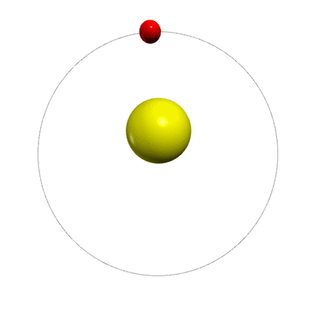

# Physics simulations for high school students

#### A one-day course enables students to program simulations that demonstrate the effects of general relativity.

Students at a particle physics academy for high schoolers in Germany simulate Mercury’s general relativity–influenced motion around the Sun. Credit: The authors

Numerical simulations are a vital part of a physicist’s professional repertoire.
Yet physics education is rarely coupled with numerical methods programming until a student’s undergraduate years.
Looking back at our educational experience, we wish that we had been taught those skills in high school.

Four years ago one of our collaborators, Joseline Heuer, conducted a graduate school project in which she analyzed the motion of planets in our solar system through a simulation that included post-Newtonian effects.
That project served as the inspiration for the development of a dual course covering general relativity and numerical simulations and catering to high schoolers with a strong interest in physics.

In 2015 we adapted Heuer’s project to create a daylong course for the [Schülerakademie Teilchenphysik](https://crc110.hiskp.uni-bonn.de/index.php?id=327), or Student Academy for Particle Physics, at the Science College Overbach in Jülich, Germany.
The weeklong academy takes place every two years and is tailored to high school students aged 16 to 19 from across Germany.

It offers activities such as lectures on various topics in particle physics, a tour of the particle accelerator COSY, and a visit to the high-performance computing facility at the Jülich Research Center.
On the last day of the academy, students participate in one of three hands-on projects.
One option was our session on numerical simulations, which tasks students with modeling the motion of Mercury around the Sun.

In developing the project, we decided to use [Python](https://www.python.org/) as the programming language and [VPython](http://vpython.org/) for graphical output.
Both are easy to learn, even for those without programming experience.
We start the day by briefly introducing the coding language and explaining the basics of differential and vector calculus, which are needed to understand the procedure for plotting Mercury’s position and velocity.
By the end of the tutorial, all the students, regardless of previous knowledge, should be able to produce the simulations.

The students begin with a basic [code template](https://github.com/ckoerber/perihelion-mercury/blob/master/py-scripts/template.py) that defines physical and numerical parameters, sets up the visual display, and highlights the basic structure of the final program.
Using the template, the students initialize their virtual Mercury and Sun, implement a function for the position and velocity update, and write a loop to evolve the orbit.
The students solve an equation of motion numerically by picking a starting position and velocity of Mercury (the Sun starts at the origin with zero velocity) and then, employing Newtonian gravity as the force, evolving the position and velocity of Mercury in time with a finite number of steps.
The result is a planet that moves in either a parabolic open curve or an elliptic closed curve, depending on the initial conditions.
In both cases, the curves are fixed in space; in particular, the perihelion, the point of closest approach of the planet to the Sun, does not move.
Figure 1 shows an example of an elliptical orbit.

**Figure 1.**
Only Newtonian gravity is used to simulate the orbit of Mercury (red) about the Sun (yellow); the planet’s elliptical closed curve is fixed in space.

The fixed perihelion is a consequence of the use of the simple Newtonian 1/r2 gravitational force, with r as the distance between the Sun and Mercury.
In reality, the perihelion of Mercury’s orbit moves around the Sun over time.
This is largely the result of the influence of other planets but is also due to perturbations in spacetime described by Albert Einstein’s general theory of relativity (GR).

Despite the complexities of GR’s underlying mathematics, a simple approximation can capture most of its effects.
We approximate the GR-induced force by including terms proportional to 1/r3 and 1/r4 in addition to the Newtonian 1/r2 term.
In the solar system, Mercury’s perihelion motion due to GR amounts to less than 42.3″ (0.011°) in a century.
However, the students were able to produce animations like the one in figure 2 by experimenting with unrealistically large strengths of the additional terms.

**Figure 2.**
When a (markedly large) contribution from general relativity is factored in, Mercury’s orbital path becomes dynamic.

At the 2015 academy, students explored the problem in groups of two.
We provided only basic guidance and encouraged the participants to pursue their own ideas.
Some students focused on understanding GR, while some played with the parameters of the system (masses, size of the time step, etc.
) and explored the boundaries of the solution in terms of stability.
 Others tossed in an additional planet, sometimes with a tilted orbital plane, and observed the chaotic nature of the three-body problem.
 Still others improved the graphical output by, for instance, marking the position of the perihelion—an idea we borrowed for later courses.

During breaks the students excitedly showed their results to the participants of the other two projects.
Even after the session, we had some interesting discussions about relativity, with the students pushing us toward, and sometimes beyond, the limits of our own knowledge.
Due to the interest and positive feedback, in 2017 we offered a second, refined iteration of our tutorial, with similar results.

We recently made the mini-course publicly available in [a paper](https://arxiv.org/abs/1803.01678) that includes additional material on analyzing numerical errors and visualizing the minuscule perihelion motion of Mercury that occurs in nature.
The additions should allow for a longer, more in-depth project for interested students.
We will continue to offer the course at the academy in the future and hope that others will have the same success and fun that we’ve had.

*Christopher Körber is a nuclear physicist and a member of the Institute for Advanced Simulation at Forschungszentrum in Jülich, Germany.
Jan-Lukas Wynen is a PhD student at the Institute for Advanced Simulation and the University of Bonn.
Inka Hammer is a PhD student at the Forschungszentrum Jülich, where she is working in the field of hardonic physics.
The authors would like to thank Joseline Heuer, Christian Müller, and Christoph Hanhart for introducing them to this course, for providing the required framework at the Schülerakademie Teilchenphysik, and for their help in writing this article.*
